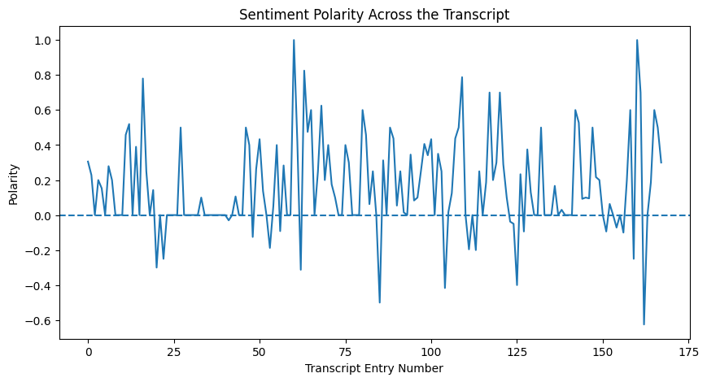

# CISD43_MtSac_Spring2026_Project_1_NLP_Sentiment_Analysis_JuanNevares_Notebook
CISD43_MtSac_Spring2026_Project_1_NLP_Sentiment_Analysis_JuanNevares_Notebook_Repository

# Findings and Conclusions:

I intentionally looked into the seleciton of a YouTube Review on different electronic products because I knew that it would offer a lot of subjectivity and polarity towards their evaluations. Whenever thinking about comparisons, we often think about what's good or bad about the idea(s) or object(s) that are being looked into themselves, or with others.

However, in the context of having viewers make their own assumptions and not be too biased in their conclusions from watching, it's likely that the person(s) credited in the video review(s) would not want to lean towards too good or too bad, and likely would try to keep the evaluations/review findings as balanced as possible.

When looking at the chart again below, from the initial analysis, we can how varied it goes back in forth between Negative to Positive, likely a sign that the content creator(s) evaluating/reporting their opinions on the findings are attempting to keep it as balanced as possible.

All this being said, there may be exceptions to this rule if it's (object or idea) is a more objectively good or bad in many other reviews or contexts within the community or world.

One thing I would like to look into (which, just occured to me while writing this), in the future is maybe:

1.   Keywords referencing each respective product.
2.   Grab sentences with each respective product mentioned.
3.   Then, conduct analysis' into each one with the similar steps performed above.

This may provide a more narrowed down review of each product, based on their own NLP and Sentiment Analysis'.
